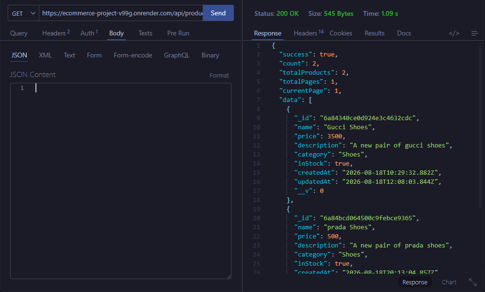
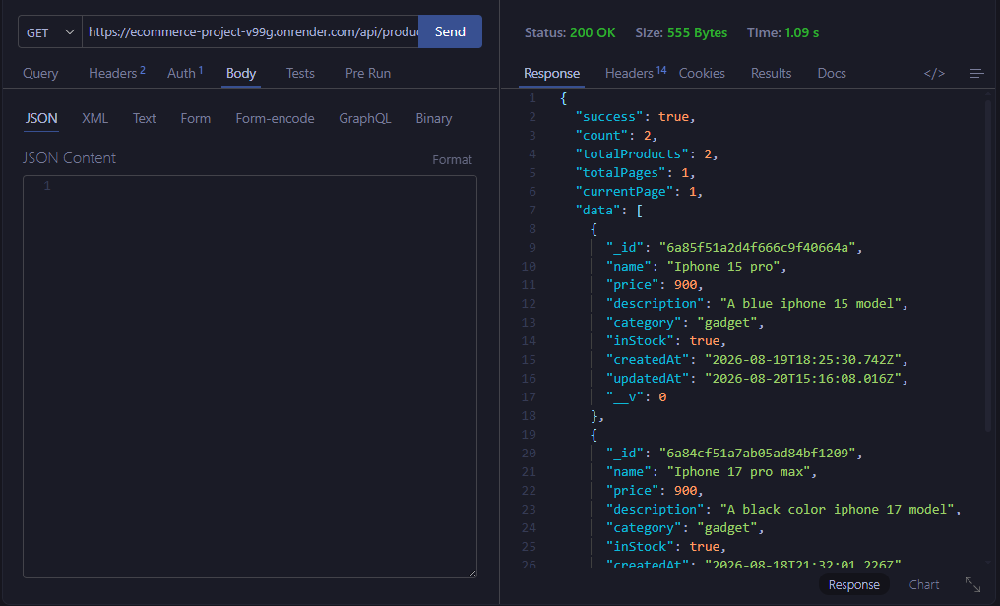

# E-commerce Product Catalog API

A production-oriented RESTful API for managing an online store's product inventory. Built as a group project to demonstrate backend fundamentals done properly: clean resource modeling, input validation, pagination and search, and a deployment pipeline that does not fall over the first time someone other than the author runs it.

Live demo: `https://<your-render-service-name>.onrender.com`
API base path: `/api/products`

---

## Table of Contents

- [E-commerce Product Catalog API](#e-commerce-product-catalog-api)
  - [Table of Contents](#table-of-contents)
  - [Overview](#overview)
  - [Architecture](#architecture)
  - [Tech Stack](#tech-stack)
  - [Project Structure](#project-structure)
  - [Data Model](#data-model)
    - [Product Schema](#product-schema)
    - [Mongoose Definition (`src/models/products.model.js`)](#mongoose-definition-srcmodelsproductsmodeljs)
  - [Getting Started](#getting-started)
    - [Prerequisites](#prerequisites)
    - [Installation](#installation)
    - [Running Locally](#running-locally)
  - [Environment Variables](#environment-variables)
  - [API Reference](#api-reference)
    - [Response Envelope](#response-envelope)
    - [Create a Product](#create-a-product)
    - [List Products (Pagination, Sorting, Search)](#list-products-pagination-sorting-search)
    - [Get a Single Product](#get-a-single-product)
    - [Update a Product](#update-a-product)
    - [Delete a Product](#delete-a-product)
  - [Validation and Error Handling](#validation-and-error-handling)
  - [Deployment](#deployment)
  - [Contributing](#contributing)
  - [Team](#team)

---

## Overview

This service is the inventory backend for an online store. It exposes a single core resource, `Product`, and supports the full CRUD lifecycle an admin needs to manage stock, plus the read/search patterns a storefront needs to let customers browse and find items.

Design goals for this project, in priority order:

1. **Correctness first.** Every write path is validated before it touches the database. No unvalidated input reaches Mongoose.
2. **Predictable API shape.** Every response follows the same envelope so client code does not need special cases per endpoint.
3. **Operational honesty.** Errors return meaningful HTTP status codes and messages, not stack traces or generic 500s for client mistakes.
4. **Deployability.** The project runs identically on a laptop and on Render with nothing but environment variables changing.

---

## Architecture

```
                    ┌─────────────────────┐
                    │   Client / Browser   │
                    │  (Postman, frontend, │
                    │   curl, etc.)         │
                    └──────────┬───────────┘
                               │ HTTPS
                               ▼
                    ┌─────────────────────┐
                    │   Express App        │
                    │  ─────────────────   │
                    │  Middleware chain:    │
                    │                       │
                    │                       │
                    │                       │
                    └──────────┬───────────┘
                               │
                               ▼
                    ┌─────────────────────┐
                    │   Route Layer         │
                    │  /api/products/*      │
                    └──────────┬───────────┘
                               │
                               ▼
                    ┌─────────────────────┐
                    │  Controller Layer      │
                    │  (business logic,      │
                    │   query building)      │
                    └──────────┬───────────┘
                               │
                               ▼
                    ┌─────────────────────┐
                    │  Validation Layer      │
                    │  (Joi schemas)         │
                    └──────────┬───────────┘
                               │
                               ▼
                    ┌─────────────────────┐
                    │  Mongoose Models      │
                    └──────────┬───────────┘
                               │
                               ▼
                    ┌─────────────────────┐
                    │  MongoDB Atlas         │
                    │  (Cluster, free tier)  │
                    └─────────────────────┘
```


---

## Tech Stack

| Layer | Choice | Reason |
|---|---|---|
| Runtime | Node.js (LTS) | Wide ecosystem, async I/O suits a read-heavy catalog API |
| Web framework | Express | Minimal, unopinionated, easy to reason about middleware order |
| Database | MongoDB Atlas (free tier) | Managed, no local ops burden, flexible schema for product attributes |
| ODM | Mongoose | Schema enforcement, hooks, and query building on top of the native driver |
| Config | dotenv | Keeps secrets out of source control |
| Validation | Joi | Declarative request validation independent of the persistence layer |
| Hosting | Render.com | Zero-config web service deploys from a GitHub branch |

---

## Project Structure

```

├── package.json
├── package-lock.json
├── server.js
└── src
    ├── controllers
    │   └── products.controller.js
    ├── databaseConfig
    │   └── connectDb.js
    ├── middlewares
    │   ├── error.middleware.js
    │   └── validation.middleware.js
    ├── models
    │   └── products.model.js
    ├── routes
    │   └── products.routes.js
    └── validations
        └── products.schema.js
```
---

## Data Model

### Product Schema

| Field | Type | Required | Default | Notes |
|---|---|---|---|---|
| `name` | String | yes | — | Trimmed, indexed for text search |
| `price` | Number | yes | — | Must be >= 0 |
| `description` | String | no | `""` | Free text |
| `category` | String | yes | — | e.g. `Electronics`, `Clothing`, `Home & Kitchen` |
| `inStock` | Boolean | no | `true` | Toggled as stock is depleted or replenished |
| `createdAt` | Date | auto | now | Set by Mongoose timestamps |
| `updatedAt` | Date | auto | now | Set by Mongoose timestamps |

### Mongoose Definition (`src/models/products.model.js`)

```javascript
const mongoose = require("mongoose");

const productSchema = new mongoose.Schema(
  {
    name: {
      type: String,
      required: [true, "Product name is required"],
      trim: true,
    },
    price: {
      type: Number,
      required: [true, "Product price is required"],
      min: [0, "Price must be a positive number"],
    },
    description: {
      type: String,
      trim: true,
    },
    category: {
      type: String,
      required: [true, "Category is required"],
      trim: true,
    },
    inStock: {
      type: Boolean,
      default: true,
    },
  },
  { timestamps: true },
);

productSchema.index({ name: "text" });

module.exports = mongoose.model("Product", productSchema);

```

The text index is what makes `?search=` efficient rather than a full collection scan with a regex on every request.

---

## Getting Started

### Prerequisites

* Node.js 18 or later
* npm 9 or later
* A MongoDB Atlas cluster (free M0 tier is sufficient) or a local MongoDB instance
* Git

### Installation

```bash
# Clone the repository
git clone https://github.com/JasonChukwuebuka01/ecommerce-project.git
cd ecommerce-project

# Install dependencies
npm install

# Copy the example environment file and fill in real values
cp .env.example .env
```

### Running Locally

```bash
# Development, with auto-restart on file changes
npm run dev

# Production-style run
npm start
```

On success you should see:

```
[server] Connected to MongoDB Atlas
[server] API listening on port 5000
```

Verify it is alive:

```bash
curl http://localhost:5000/api/products
```

---

## Environment Variables

Create a `.env` file in the project root. Never commit this file; `.env.example` is the checked-in template.

```dotenv
# .env.example

# Server
PORT=5000

# Database
MONGO_URI=mongodb+srv://<username>:<password>@<cluster-url>/ecommerce?retryWrites=true&w=majority


```

| Variable | Required | Description |
|---|---|---|
| `PORT` | no | Port the Express server listens on. Defaults to `5000`. Render injects its own `PORT` at runtime, which the app must respect. |
| `MONGO_URI` | yes | Full MongoDB Atlas connection string, including credentials and database name. |

---

## API Reference

All endpoints are prefixed with `/api/products`. All responses use `Content-Type: application/json`.

### Response Envelope

Successful responses:

```json
{
  "success": true,
  "data": { },
  "meta": { }
}
```

Error responses:

```json
{
  "success": false,
  "error": {
    "message": "Human-readable explanation",
    "details": []
  }
}
```

---

### Create a Product

`POST /api/products`

Request body:

```json
{
  "name": "Wireless Mechanical Keyboard",
  "price": 89.99,
  "description": "Hot-swappable switches, USB-C, 75% layout.",
  "category": "Electronics",
  "inStock": true
}
```

Successful response — `201 Created`:

```json
{
  "success": true,
  "data": {
    "_id": "665f1c2e4b1a2c0012ab34cd",
    "name": "Wireless Mechanical Keyboard",
    "price": 89.99,
    "description": "Hot-swappable switches, USB-C, 75% layout.",
    "category": "Electronics",
    "inStock": true,
    "createdAt": "2026-08-19T09:12:44.101Z",
    "updatedAt": "2026-08-19T09:12:44.101Z"
  }
}
```

Validation failure — `400 Bad Request`:

```json
{
  "success": false,
  "error": {
    "message": "Validation failed",
    "details": [
      "\"price\" must be a positive number",
      "\"category\" is required"
    ]
  }
}
```

curl example:

```bash
curl -X POST http://localhost:5000/api/products \
  -H "Content-Type: application/json" \
  -d '{
        "name": "Wireless Mechanical Keyboard",
        "price": 89.99,
        "category": "Electronics"
      }'
```

---

### List Products (Pagination, Sorting, Search)

`GET /api/products`

Query parameters:

| Param | Type | Default | Example | Description |
|---|---|---|---|---|
| `page` | integer | `1` | `?page=2` | Page number, 1-indexed |
| `limit` | integer | `10` | `?limit=25` | Items per page, capped at 100 server-side |
| `sort` | string | `-createdAt` | `?sort=price` | `price` ascending, `-price` descending, likewise for `name`, `createdAt` |
| `search` / `name` | string | none | `?search=keyboard` | Case-insensitive text match on `name` and `description` |
| `category` | string | none | `?category=Shoes` | Exact-match category filter |
| `inStock` | boolean | none | `?inStock=true` | Filter by stock status |

Example request — page 1, 5 per page, cheapest first, filtered by category:

```bash
curl "https://ecommerce-project-v99g.onrender.com/api/products?page=1&limit=5&category=Shoes&sort=-price"
```

Response — `200 OK`:

```json
{
  "success": true,
  "count": 2,
  "totalProducts": 2,
  "totalPages": 1,
  "currentPage": 1,
  "data": [
    {
      "_id": "6a84340ce0d924e3c4632cdc",
      "name": "Gucci Shoes",
      "price": 3500,
      "description": "A new pair of gucci shoes",
      "category": "Shoes",
      "inStock": true,
      "createdAt": "2026-08-18T10:29:32.882Z",
      "updatedAt": "2026-08-18T12:08:03.844Z",
      "__v": 0
    },
    {
      "_id": "6a84bcd064500c9febce9365",
      "name": "prada Shoes",
      "price": 500,
      "description": "A new pair of prada shoes",
      "category": "Shoes",
      "inStock": true,
      "createdAt": "2026-08-18T20:13:04.857Z",
      "updatedAt": "2026-08-18T20:13:04.857Z",
      "__v": 0
    }
  ]
}
```



Search example:

```bash
curl "https://ecommerce-project-v99g.onrender.com/api/products?search=iphone&sort=-price"
```

This matches any product whose `name` or `description` contains "keyboard" (case-insensitive), sorted highest price first.

---





### Get a Single Product

`GET /api/products/:id`

```bash
curl https://ecommerce-project-v99g.onrender.com/api/products/6a84cf51a7ab05ad84bf1209
```

Response — `200 OK`:

```json
{
  "message": "Product found",
  "product": {
    "_id": "6a84cf51a7ab05ad84bf1209",
    "name": "Iphone 17 pro max",
    "price": 900,
    "description": "A black color iphone 17 model",
    "category": "gadget",
    "inStock": true,
    "createdAt": "2026-08-18T21:32:01.226Z",
    "updatedAt": "2026-08-18T21:32:01.226Z",
    "__v": 0
  }
}
```

Not found — `404 Not Found`:

```json
{
  "message": "No product found"
}
```

Malformed ID — `400 Bad Request`:

```json
{
  "success": false,
  "message": "Validation Error",
  "error": "Product ID must be a valid 24-character hex string,Product ID must be exactly 24 characters long"
}
```

This distinction matters: an invalid ObjectId is a client error (`400`), while a well-formed ID that does not exist is a `404`. Collapsing both into one status code is a common shortcut this project deliberately avoids.

---

### Update a Product

`PUT /api/products/:id`

Partial updates are supported; only the fields present in the body are validated and applied.

```bash
curl -X PUT https://ecommerce-project-v99g.onrender.com/api/products/6a85f51a2d4f666c9f40664a\
  -H "Content-Type: application/json" \
  -d '{ "description": "A blue iphone 15 model",}'
```

Response — `200 OK`:

```json
{
  "message": "Product updated successfully",
  "product": {
    "_id": "6a85f51a2d4f666c9f40664a",
    "name": "Iphone 15 pro",
    "price": 900,
    "description": "A blue iphone 15 model",
    "category": "gadget",
    "inStock": true,
    "createdAt": "2026-08-19T18:25:30.742Z",
    "updatedAt": "2026-08-20T15:16:08.016Z",
    "__v": 0
  }
}
```

---

### Delete a Product

`DELETE /api/products/:id`

```bash
curl -X DELETE https://ecommerce-project-v99g.onrender.com/api/products/6a85f51a2d4f666c9f40664a
```

Response — `200 OK`:

```json
{
  "message": "Product have been removed from the list"
}
```

A second delete of the same ID returns `404 Not Found`, not a silent success. Idempotent-looking deletes that hide the "it was already gone" case tend to mask bugs upstream, so this API reports it explicitly.

---

## Validation and Error Handling

Every write endpoint runs its payload through a Joi schema before Mongoose is touched.

```javascript
const Joi = require("joi");

// Schema for POST /api/products (Create product)
const createProductSchema = Joi.object({
  name: Joi.string().trim().min(2).max(60).required().messages({
    "string.base": "Product name must be a string",
    "string.empty": "Product name is required",
    "string.min": "Product name must be at least 2 characters",
    "string.max": "Product name cannot exceed 60 characters",
    "any.required": "Product name is a required field",
  }),

  price: Joi.number().min(0).required().messages({
    "number.base": "Price must be a valid number",
    "number.min": "Price cannot be less than 0",
    "any.required": "Price is a required field",
  }),

  description: Joi.string().trim().max(1000).allow("").optional().messages({
    "string.base": "Description must be a string",
    "string.max": "Description cannot exceed 1000 characters",
  }),

  category: Joi.string().trim().required().messages({
    "string.base": "Category must be a string",
    "string.empty": "Category is required",
    "any.required": "Category is a required field",
  }),

  inStock: Joi.boolean().default(true).messages({
    "boolean.base": "inStock must be a boolean value (true or false)",
  }),
});


const getProductsQuerySchema = Joi.object({
  page: Joi.number().integer().min(1).default(1),
  limit: Joi.number().integer().min(1).max(100).default(10),
  sort: Joi.string().trim(),
  name: Joi.string().trim(),
  search: Joi.string().trim(),
});


const objectIdSchema = Joi.object({
  id: Joi.string()
    .hex()
    .length(24)
    .required()
    .messages({
      'string.hex': 'Product ID must be a valid 24-character hex string',
      'string.length': 'Product ID must be exactly 24 characters long',
      'any.required': 'Product ID is required'
    }),
});


module.exports = {
  createProductSchema,
  objectIdSchema,
  getProductsQuerySchema

};

```

Errors are normalized through a single custom error class and a centralized error-handling middleware, so controllers never format an error response themselves:


```javascript
const globalError = (err, req, res, next) => {
    const statusCode = err.statusCode || 500;
    const message = err.message || "Internal Server Error";

    res.status(statusCode).json({
        success: false,
        statusCode,
        message
    });
};

module.exports = globalError;
```

This means a controller reads simply as: validate, attempt the operation, throw `ApiError` on failure, and let the middleware do the rest.

## Deployment

This project is deployed as a Render Web Service.

1. Push the repository to GitHub.
2. In the Render dashboard, create a new **Web Service** and connect the repository.
3. Configure the service:
   * **Build Command:** `npm install`
   * **Start Command:** `npm start`
   * **Node Version:** matches the `engines` field in `package.json`
4. Add environment variables in the Render dashboard under **Environment** (`MONGO_URI`, `PORT`).
5. In MongoDB Atlas, under **Network Access**, allow connections from anywhere (`0.0.0.0/0`) or from Render's published IP ranges.
6. Trigger a deploy. Render builds on every push to the connected branch by default.

The app reads `process.env.PORT` rather than hardcoding a port:

---


## Contributing

1. Fork the repository and create a feature branch: `git checkout -b feature/short-description`.
2. Keep commits scoped and use descriptive messages.
3. Open a pull request against `main` and fill in the PR template, including what changed and how it was tested.
4. At least one other team member reviews and approves before merge.

---

## Team

| GitHub |
|---|---|---|
|   `@JasonChukwuebuka01` |
|  `@Emmacfemi` |
|  `@ViCode-X` |

---

